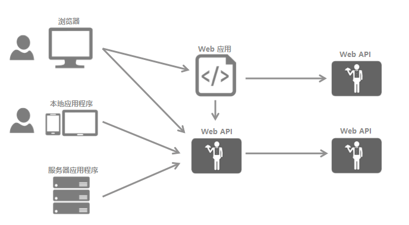
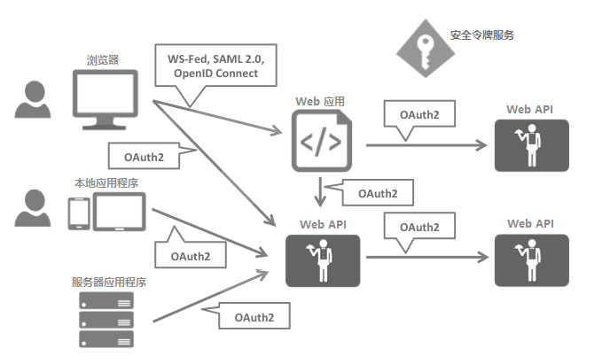
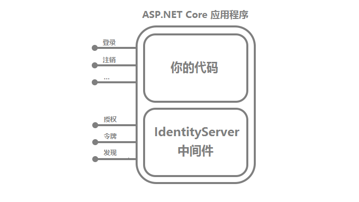

# IdentityServer4 中文文档 -1- （简介）背景

-----------------------------------------------------------

现代应用程序看上去大都是这样的:

常见的交互方式包括：

* 浏览器 与 Web应用程序 通信；
* Web应用程序 与 Web API 通信（Web应用程序自身 或 代表用户 与 Web API 通信）；
* 基于浏览器的应用程序 与 Web API 通信；
* 本地应用程序 与 Web API 通信；
* 基于服务器的应用程序 与 Web API 通信；
* Web API 与 Web API 通信（WebAPI自身 或 代表用户与另一个WebAPI 通信）；

将基础安全功能外包给一个安全令牌服务（STS,Security Token Service），能够避免这些应用程序以及端点之间的功能性重复。

重组应用程序以支持一个安全令牌服务，能够导出以下架构和协议：

这样的设计把安全问题分成了两个部分：

## 身份认证

当一个应用程序需要知道当前用户的身份（Identity）的时候就要用到身份认证（Authentication）。通常情况下这些应用程序托管着代表该用户的数据，并且必须确保该用户只能访问被允许访问的数据。最常见的例子就是传统的web应用程序 —— 但是本地应用程序和基于JS的应用程序也同样需要身份认证。

最常见的身份认证协议是 SAML2p、WS-Federation 和 OpenID Connect——SAML2p 是最受欢迎的，也是部署得最广泛的。

OpenID Connect 是三种协议中最新的一种，但它却被认为是未来的趋势，因为它对于现代应用程序来说最具潜力。它从一开始就是为移动应用场景而构建的，并且被设计成了友好的API。

## API访问

应用程序有两种基础的方式与API通信 —— 使用应用程序身份，或者使用代表用户的身份。有时候需要联合使用这两种方式。

OAuth2 是一个通信协议，它允许应用程序向安全令牌服务请求访问令牌，然后通过访问令牌与API通信。这同时减少了客户应用程序和API的复杂性，因为认证和授权可以是集中式的。

## OpenID Connect和OAuth2 —— 结合使用更好

OpenID Connect和OAuth2非常相似 —— 实际上前者是后者的顶级扩展。它们把两个基础安全问题（身份认证和 API 访问）合并成了一个单一的协议 —— 通常这只是与安全令牌服务的一个往返交互。

我们坚信，将 OpenID Connect 和 OAuth2 结合以保护现代应用程序，在可预见的未来，肯定会是最佳实践。IdentityServer4 是这两种协议的实现，并且它已经被高度优化以解决当今 移动应用程序、本地应用程序 和 Web应用程序 的典型安全问题。

## IdentityServer4 能做什么？

**IdentityServer4 是一个中间件** ,它能够将符合规范的 OpenID Connect 和 OAuth2.0 端点添加到任意一个 ASP.NET Core 应用程序中。

通常，在你构建（或者复用）一个包含登录和注销页（或者 授权确认页）的应用程序的时候，IdentityServer 中间件会将需要的协议添加到页面头部，这样一来客户端应用程序就能够使用这些标准协议跟它协商了。

你可以根据你的需要使用尽可能复杂的宿主应用程序。但是，为了保持受攻击面尽可能小, 我们一般建议你只将认证相关的UI包含进来。