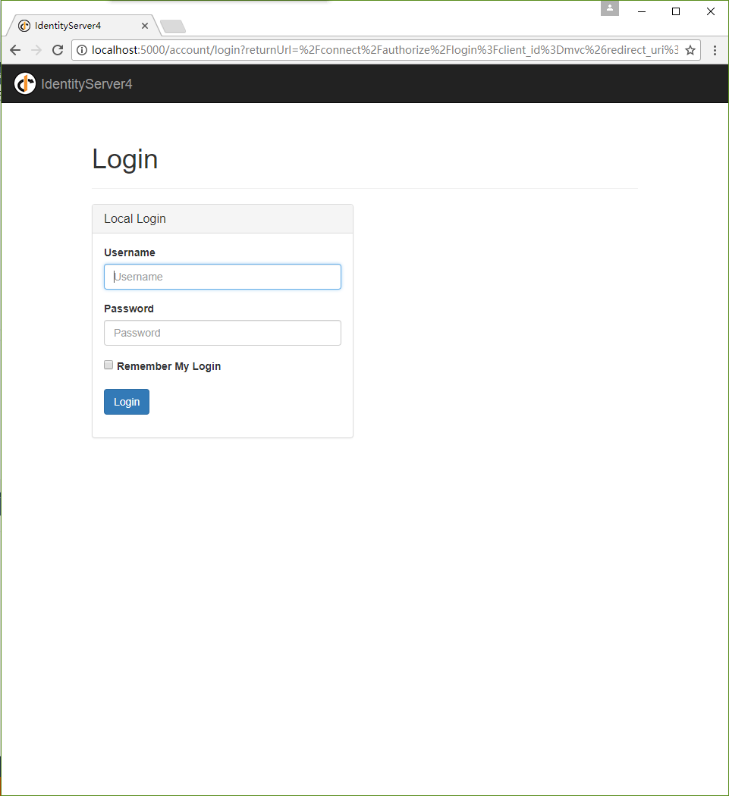
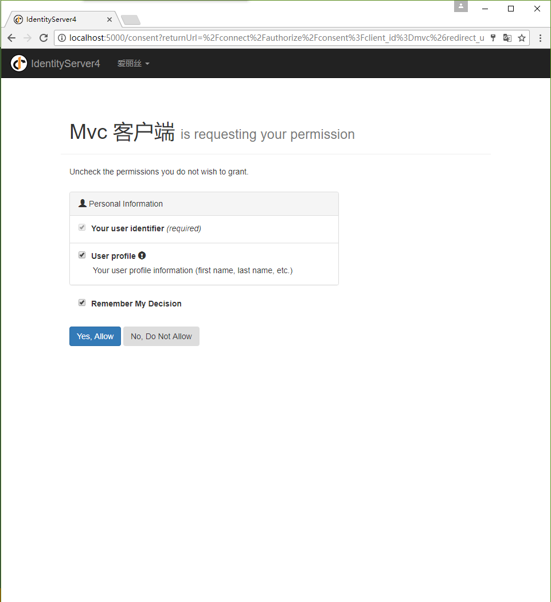
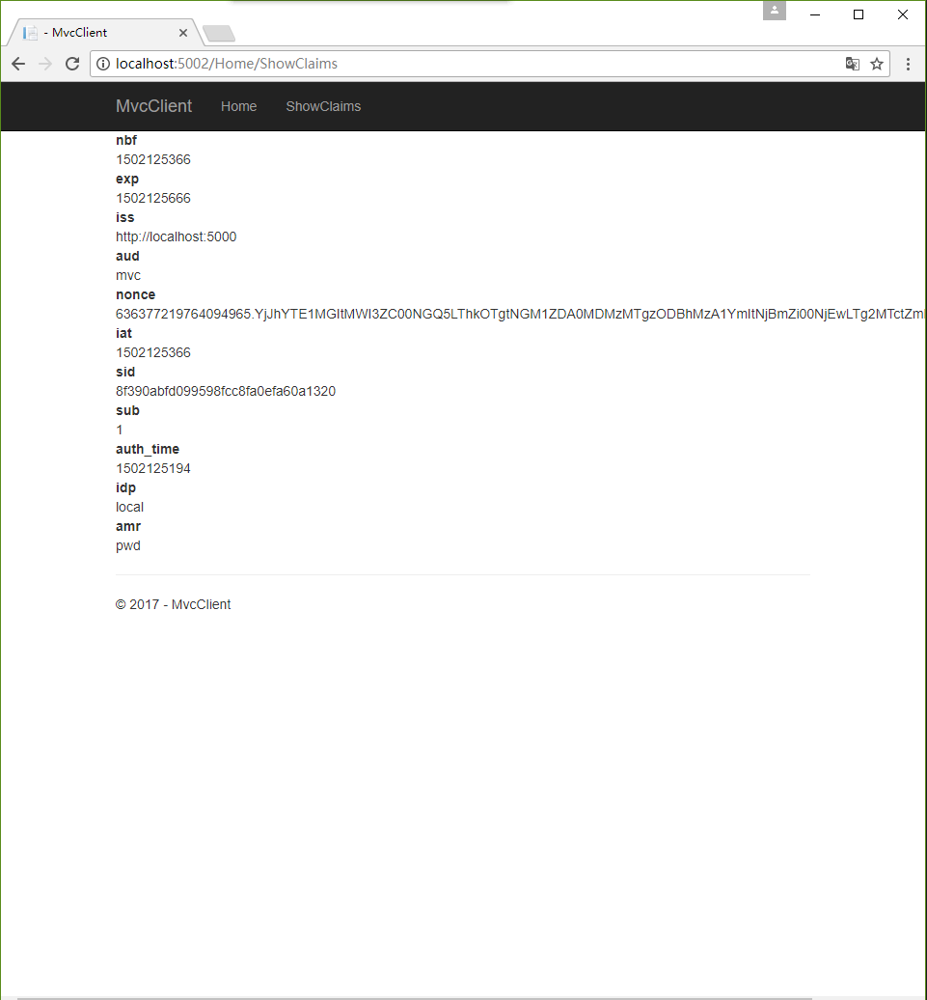

# IdentityServer4 中文文档 -11- （快速入门）添加基于 OpenID Connect 的用户认证

---------------------------------------------------------------------------------------------------------

在这个快速启动中，我们希望通过OpenID Connect协议向我们的 IdentityServer 添加对交互式用户身份验证的支持。

完成之后，我们将创建一个使用 IdentityServer 进行身份认证的 MVC 应用程序。

## 添加 UI(用户界面)

IdentityServer 内置了 OpenID Connect 需要的所有协议支持。你需要提供必需的 UI 部分，包括 登录、注销、授权确认以及错误页。

因为在每个 IdentityServer 的实现中，视觉、感觉以及实际工作流可能总是有所不同的，所以我们提供了一套基于 MVC 的样例 UI，你可以将其作为启动点来使用。

这套 UI 可以在 [快速入门仓库](https://github.com/IdentityServer/IdentityServer4.Quickstart.UI/tree/release) 找到。你还可以克隆或下载这个仓库，将其中的控制器、视图、模型以及 CSS 放到你的 Web 应用程序中。

你还可以在你的 Web 应用程序中以命令行的方式运行以下命令来自动下载：

```cmd
iex ((New-Object System.Net.WebClient).DownloadString('https://raw.githubusercontent.com/IdentityServer/IdentityServer4.Quickstart.UI/release/get.ps1'))
```

查看 [自述文件](https://github.com/IdentityServer/IdentityServer4.Quickstart.UI/blob/release/README.md) 以了解更多 快速入门UI 相关的信息。

> 注意： UI 仓库的 `release` 分支拥有与最新发布的稳定版相匹配的 UI。`dev` 分支则与 IdentityServer4 的当前开发构建相符。如果你想要寻找指定版本的 UI，请查看相应的标签。

花一些时间去查阅控制器和模型，你越是了解他们，将来要修改他们就越简单。大部分代码都以“功能目录”的样式放在 “Quickstart” 文件夹下，如果这种样式不适合你，那就按照你想要的方式随意组织代码。

## 创建一个 MVC 客户端

接下来你将向解决方案添加一个 MVC 应用程序，可以使用 ASP.NET Core "Web 应用程序" 模板来实现。 将应用程序配置为使用 5002 端口（可以查看概览部分以了解如何配置）。

为了能向 MVC 应用程序添加 OpenID Connect 认证支持，请添加如下 NuGet 程序包：

* Microsoft.AspNetCore.Authentication.Cookies
* Microsoft.AspNetCore.Authentication.OpenIdConnect

然后添加这两个中间件到你的管道中 —— Cookies 对应的中间件很简单：

```CSharp
app.UseCookieAuthentication(new CookieAuthenticationOptions
{
    AuthenticationScheme="Cookies"
});
```

OpenID Connect 中间件需要稍微多一些配置。将它指向 Identity Server，指定一个客户端 ID 并且告诉它哪个中间件将会负责本地登陆（也就是 cookies 中间件）。此外，我们关闭了 JWT 身份信息类型映射，这样就允许 well-known 身份信息（比如，“sub” 和 “idp”） 无干扰地流过。这个身份信息类型映射的 “清理” 必须在调用 `UseOpenIdConnectAuthentication()` 之前完成：

```CSharp
JwtSecurityTokenHandler.DefaultInboundClaimTypeMap.Clear();

app.UseOpenIdConnectAuthentication(new OpenIdConnectOptions
{
    AuthenticationScheme = "oidc",
    SignInScheme = "Cookies",
    Authority = "http://localhost:5000",
    RequireHttpsMetadata = false,
    ClientId = "mvc",
    SaveTokens = true
});
```

**两个中间件都应该在 MVC 之前添加到管道。**

下一个步骤是触发认证握手，为此打开 `home` 控制器并添加 `[Authorize]` 到其中一个 `action` 上。另外，修改 action 对应的视图以显示用户的身份信息，比如：

```CSharp
<dl>
    @foreach (var claim in User.Claims)
    {
        <dt>@claim.Type</dt>
        <dd>@claim.Value</dd>
    }
</dl>
```

现在，如果你使用浏览器导航到上述控制器，一个Mvc客户端将视图重定向到 IdentityServer - 这会导致错误，因为 MVC 客户端还没有注册（在 IdentityServer 上定义）呢。

## 添加 OpenID Connect 身份 Scopes 支持

与 OAuth 2.0 相似，OpenID Connect 也使用 scopes 这个概念。再一次说明，Scopes 表示你想要保护的和客户端想要访问的事物。在与 OAuth 相比，OIDC(OpenID Connect) 中的 scopes 不仅代表 API，还代表了诸如 用户id、用户名 或 邮箱地址等身份数据。

通过（在 Config.cs 中）添加新的帮助器来创建 `IdentityResource` 对象的集合，可以添加对标准 `openid`（subject id，这里指的是用户id）和 `profile`（姓氏，名称 等等）等 scopes 的支持：

```CSharp
public static IEnumerable<IdentityResource> GetIdentityResources()
{
    return new List<IdentityResource>
    {
        new IdentityResources.OpenId(),
        new IdentityResources.Profile(),
    };
}

```

> 注意：所有标准的 Scopes 和他们对应的 身份信息 都可以在 [OpenID Connect 规范](https://openid.net/specs/openid-connect-core-1_0.html#ScopeClaims) 中找到。

接下来在 `Startup.cs` 中你要将这些身份资源添加到你的 IdentityServer 配置。在你调用 `AddIdentityServer()` 的地方使用 `AddInMemoryIdentityResources` 扩展方法即可：

```CSharp
public void ConfigureServices(IServiceCollection services)
{
    // 使用内存存储，密钥，客户端和资源来配置身份服务器。
    services.AddIdentityServer()
        .AddTemporarySigningCredential()
        .AddInMemoryApiResources(Config.GetApiResources())
        .AddInMemoryClients(Config.GetClients())
        .AddTestUsers(Config.GetUsers())
        .AddInMemoryIdentityResources(Config.GetIdentityResources());
}
```

## 为 OIDC 隐式流添加客户端定义

最后一个步骤是为 IdentityServer 添加一个新的客户端。

目前，我们添加的基于 OIDC 的客户端与 OAuth 2.0 客户端非常相似。但是由于 OIDC 中的流总是交互式的，所以我们需要添加一些重定向 URL 到我们的配置中。

添加以下代码到你的客户端配置中：

```CSharp
public static IEnumerable<Client> GetClients()
{
    return new List<Client>
    {
        // 省略的客户端...

        // OIDC 隐式流客户端（MVC）
        new Client
        {
            ClientId = "mvc",
            ClientName = "Mvc 客户端",
            AllowedGrantTypes = GrantTypes.Implicit,
            // 登录后重定向到的地址
            RedirectUris = { "http://localhost:5002/signin-oidc" },
            // 设置授权的scopes
            AllowedScopes = new List<string>
            {
                IdentityServerConstants.StandardScopes.OpenId,
                IdentityServerConstants.StandardScopes.Profile
            }
        }
    };
}
```

## 测试 MVC 客户端

现在，对于新的 MVC 客户端，一切都准备好了。

将浏览器导航到受保护的 控制器 action 以触发认证握手。你应该能看到客户端将你重定向到了 IdentityServer 的登录也。



登录成功后，用户将在授权确认页中被呈现出来。在这里用户可以决定他是否想要发布他的身份信息给客户端应用程序。

> 注意： 授权确认页可以通过客户端定义对象的 `RequireConsent` 属性被关闭（以每个客户端为单位）。



最终浏览器将被重定向回客户端应用程序，即展示用户的身份信息。



> 注意：在开发期间你有时候可能会看到 **无法验证令牌** 的异常信息。这是因为实际上签名密钥材料是凭空产生的，并且在只内存中驻留。这个异常在 客户端 与 IdentityServer 不同步时就会发生。简单地重复客户端上的操作，等到下一次元数据被捕获时，一切都会再次正常工作的。

## 添加注销

最后的最后，是给 MVC 客户端添加 **注销**功能。

通过 IdentityServer 这样的服务进行身份认证，单单清除本地应用程序的 Cookies 是不够的。你还需要往返一次 IdentityServer 来清理集中式单点登录会话。

具体的协议步骤都在 OpenID Connect 中间件中实现了，简单地添加以下代码到某个控制器中就可以用来触发注销：

```CSharp
public async Task Logout()
{
    await HttpContext.Authentication.SignOutAsync("Cookies");
    await HttpContext.Authentication.SignOutAsync("oidc");
}
```

## 进一步实验

如前面所说，OpenID Connect 中间件默认会请求 _profile_ scope。这个 scope 还包含了用户名或个人主页等身份信息。

让我们将这些身份信息添加到用户定义里面，这样的话 IdentityServer 就可以把它们放到身份令牌中了：

```CSharp

public static List<TestUser> GetUsers()
{
    return new List<TestUser>()
    {
        new TestUser
        {
            SubjectId="1",
            Username="爱丽丝",
            Password="password",


            Claims = new []
            {
                new Claim("name", "爱丽丝"),
                new Claim("website", "https://alice.com")
            }
        },
        new TestUser
        {
            SubjectId="2",
            Username="博德",
            Password="password",

            Claims = new []
            {
                new Claim("name", "博德"),
                new Claim("website", "https://bob.com")
            }
        }
    };
}
```

下一次你认证的时候，你的身份信息页将会显示额外的身份信息。

请随意添加更多的身份信息 - 还有更多的 scopes。OpenID Connect 中间件上的 `Scope` 属性是你用来配置哪些 Scopes 将在认证期间被发送到 IdentityServer 的地方。

值得注意的是，对令牌中身份信息的遍历是一个扩展点 - `IProfileService`。因为我们正在使用 `AddTestUser`，所以默认使用的是 `TestUserProfileService`。你可以检出[这里的源代码](https://github.com/IdentityServer/IdentityServer4/blob/dev/src/IdentityServer4/Test/TestUserProfileService.cs)来查看它的工作原理。
