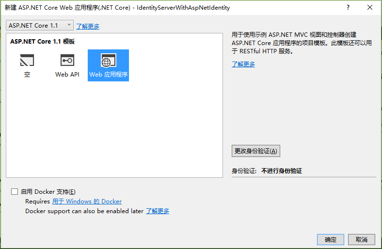
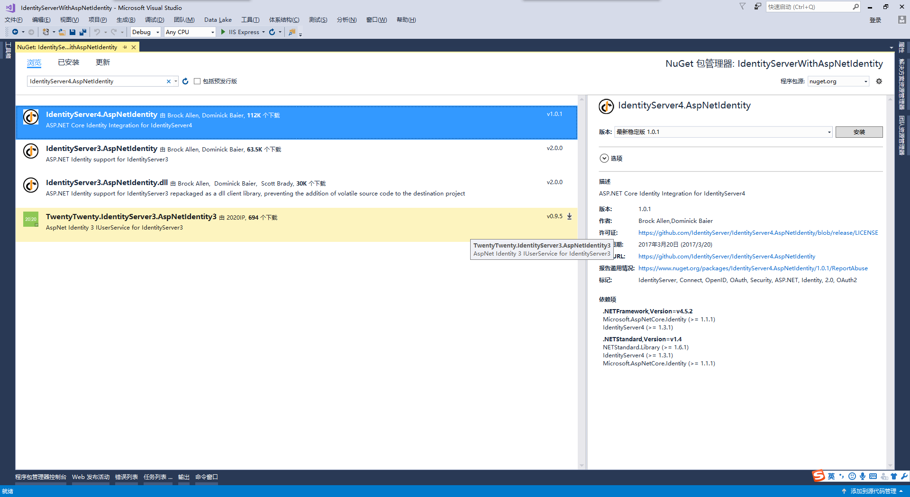
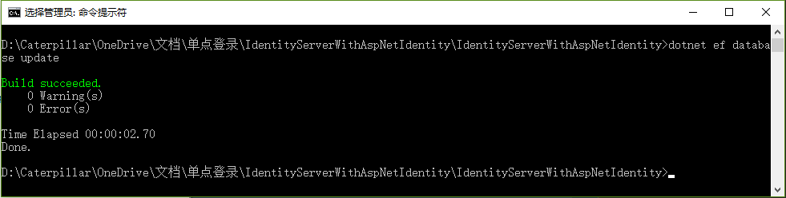
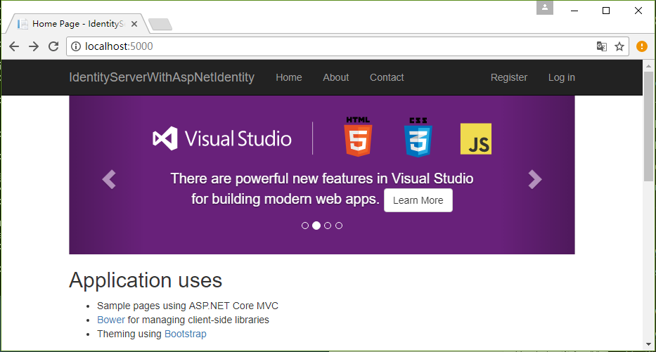
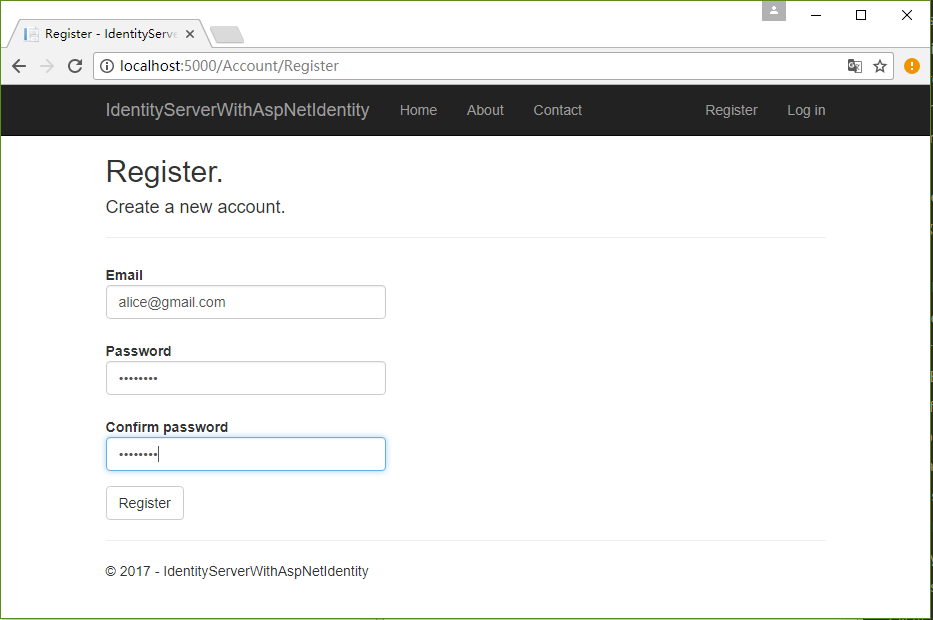
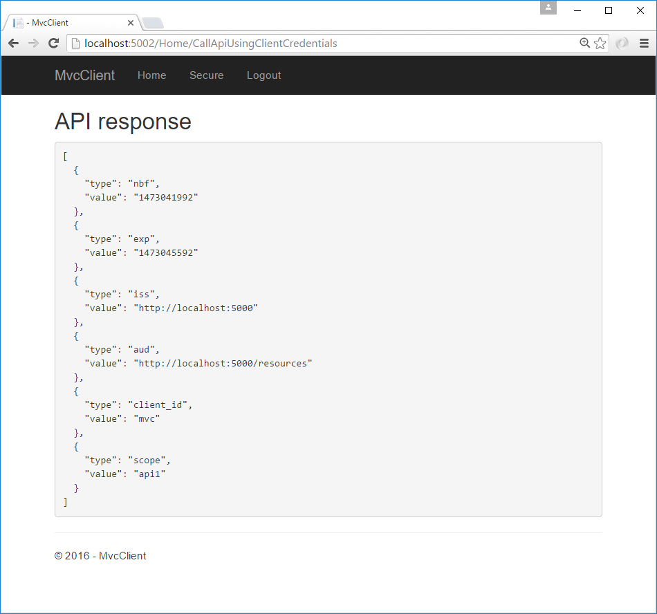

# IdentityServer4 中文文档 -14- （快速入门）使用 ASP.NET Core Identity

-------------------------------------------------------------------------------------------

IdentityServer 是为灵活性而设计的，其中的表现之一就是，它允许你使用任何你想要用的数据库来存储你的用户以及他们的数据（包括账户密码）。如果你正在从一个全新的用户数据库开始，那么 ASP.NET Identity 是你的选项之一。这个快速入门显示了如何以 IdentityServer 的方式使用 ASP.NET identity。

当前快速入门假设你已经通过了所有之前的快速入门。该快速入门使用 ASP.NET Identity 的方法是从 Visual Studio 中的 ASP.NET Identity 模板创建一个新的项目。新项目将替代之前的快速入门中我们从零开始构建的 IdentityServer 项目。解决方案中的其他所有项目（客户端和API）都将保持不变。

## 用于 ASP.NET Identity 的新项目

第一步是为 ASP.NET Identity 添加一个新项目到你的解决方案中。

考虑到 ASP.NET Identity 需要大量代码，使用 Visual Studio 中的模板会非常有意义。你最终将会删除掉之前旧的 IdentityServer 项目（假设你之前是严格按照快速入门做的），但是你需要将一些项迁移过来（或者跟之前的快速入门一样从零开始重写）。

从创建一个新的 “ASP.NET Core Web 应用程序”项目开始：


然后选择 “Web 应用程序” 选项：



然后点击“更改身份验证”按钮，选择“个人用户账户”（这意味着使用的是 ASP.NET Identity）：


最后是点击确定以创建项目。

## 修改宿主

别忘了修改宿主（像[之前描述的](http://docs.identityserver.io/en/release/quickstarts/0_overview.html#modify-hosting)一样）以让应用程序运行在 5000 端口上。这对于让已有的客户端和 api 项目能继续工作很重要。

## 添加 IdentityServer 程序包

添加 `IdentityServer4.AspNetIdentity` NuGet 程序包（目前的最新版本是“1.0.1”）。该程序包依赖于 `IdentityServer4` 程序包，所以这些会作为传递依赖被自动添加：



## Scopes 和 客户端 配置

尽管这是一个 IdentityServer 新项目，但是我们仍然需要与之前快速入门中一样的 Scope 和 客户端 配置。将之前快速入门中的配置类（[Config.cs](https://github.com/IdentityServer/IdentityServer4.Samples/blob/dev/Quickstarts/1_ClientCredentials/src/QuickstartIdentityServer/Config.cs) 文件）复制到现在这个新项目中。

（现在）需要对配置文件做的变更之一是禁用 MVC 客户端的授权确认页。我们还没有将之前 IdentityServer 项目中的授权确认代码拷贝过来，所以现在要对 MVC 客户端进行修改，将 RequireConsent 设置为 false：

```CSharp
new Client
{
    ClientId = "mvc",
    ClientName = "MVC 客户端",
    AllowedGrantTypes = GrantTypes.HybridAndClientCredentials,

    RequireConsent = false,

    ClientSecrets =
    {
        new Secret("secret".Sha256())
    },

    RedirectUris           = { "http://localhost:5002/signin-oidc" },
    PostLogoutRedirectUris = { "http://localhost:5002/signout-callback-oidc" },

    AllowedScopes =
    {
        IdentityServerConstants.StandardScopes.OpenId,
        IdentityServerConstants.StandardScopes.Profile,
        "api1"
    },
    AllowOfflineAccess = true
}
```

## 配置 IdentityServer

跟之前一样，IdentityServer 需要在 Startup.cs 的 `ConfigureServices` 和 `Configure` 中进行配置。

### ConfigureServices

这里同时展示了 ASP.NET Identity 模板生成的代码以及 IdentityServer 需要的额外功能代码（末尾）。在之前的快速入门中，`AddTestUsers` 扩展方法被用来注册用户，但是在现在这个环境中我们将用扩展方法 `AddAspNetIdentity` 替代它，以使用 ASP.NET Identity 用户替代内存用户。 `AddAspNetIdentity` 扩展方法需要一个泛型参数，即你的 ASP.NET 用户类型（与模板中 `AddIdentity` 方法需要用户类型参数一样）。

```CSharp
public void ConfigureServices(IServiceCollection services)
{
    services.AddDbContext<ApplicationDbContext>(options =>
        options.UseSqlServer(Configuration.GetConnectionString("DefaultConnection")));

    services.AddIdentity<ApplicationUser, IdentityRole>()
        .AddEntityFrameworkStores<ApplicationDbContext>()
        .AddDefaultTokenProviders();

    services.AddMvc();

    services.AddTransient<IEmailSender, AuthMessageSender>();
    services.AddTransient<ISmsSender, AuthMessageSender>();

    services.AddIdentityServer()
        .AddTemporarySigningCredential()
        .AddInMemoryApiResources(Config.GetApiResources())
        .AddInMemoryClients(Config.GetClients())
        .AddInMemoryIdentityResources(Config.GetIdentityResources())
        .AddAspNetIdentity<ApplicationUser>();
}
```

### Configure

这里也同时展示了 ASP.NET Identity 模板生成的代码以及 IdentityServer 需要的额外功能代码（紧跟在 `UseIdentity` 之后）。当使用 ASP.NET Identity 时候，IdentityServer 放在 ASP.NET Identity 之后注册到管道是很重要的，因为 IdentityServer  依赖于 ASP.NET Identity 创建和管理的认证Cookie。

```CSharp
public void Configure(IApplicationBuilder app, IHostingEnvironment env, ILoggerFactory loggerFactory)
{
    loggerFactory.AddConsole(Configuration.GetSection("Logging"));
    loggerFactory.AddDebug();

    if (env.IsDevelopment())
    {
        app.UseDeveloperExceptionPage();
        app.UseDatabaseErrorPage();
        app.UseBrowserLink();
    }
    else
    {
        app.UseExceptionHandler("/Home/Error");
    }

    app.UseStaticFiles();

    app.UseIdentity();

    app.UseIdentityServer();

    app.UseMvc(routes =>
    {
        routes.MapRoute(
            name: "default",
            template: "{controller=Home}/{action=Index}/{id?}");
    });
}
```

## 创建用户数据库

因为这是一个新的 ASP.NET Identity 项目，所以你需要创建数据库。你可以在项目目录下运行命令提示符，并运行命令 `dotnet ef database update`，像这样：



## 创建用户

现在，你应该能够运行项目并创建/注册用户到数据库了。启动应用程序，然后点击 Home 页面的 “Register” 链接：



在注册页面上创建一个新的用户帐户:



那么现在你就有了一个用户账户了，你应该能够登录，使用客户端以及调用 API。

## 登录 MVC 客户端

启动 MVC 客户端应用程序，你应该能够点击 “Secure” 链接来进入登录页：


你应该会被重定向到 ASP.NET Identity 登录页。使用新创建的用户登录：


登录后，你应该已经直接跳过了授权确认页面（想一下我们之前所做的变更），然后马上就重定向回 MVC 客户端应用程序，随之你的用户身份信息也应该被展示出来：


点击 “Call Api using application identity”，你应该还能够以用户的身份调用 API：



那么现在你已经是通过 ASP.NET Identity 的用户进行登录的了。

## 接下来做什么？

之前快速入门中的 IdentityServer 项目提供了一个授权确认页面，一个错误页面，以及一个注销页面，现在这些丢失的代码片段可以简单地从先前的快速入门项目中拷贝过来。做完这一步，你就可以将旧的 IdentityServer 项目删掉/清除了。还有，做完这一步后别忘了重新启用 MVC 客户端配置的授权确认页（RequireConsent=true 标记）。

[当前快速入门的样例代码](https://github.com/IdentityServer/IdentityServer4.Samples/tree/dev/Quickstarts/6_AspNetIdentity)已经为你完成了这些步骤，所以你可以快速地开始使用所有这些特性。祝你愉快！
