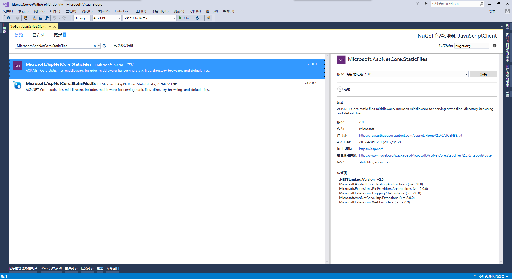
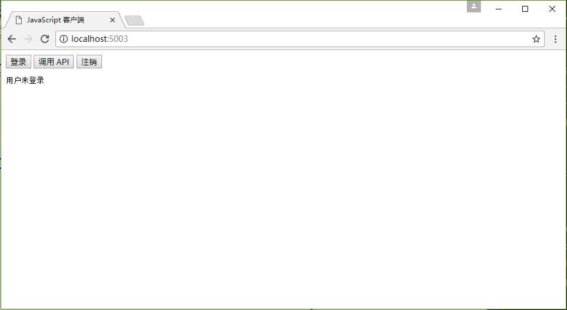
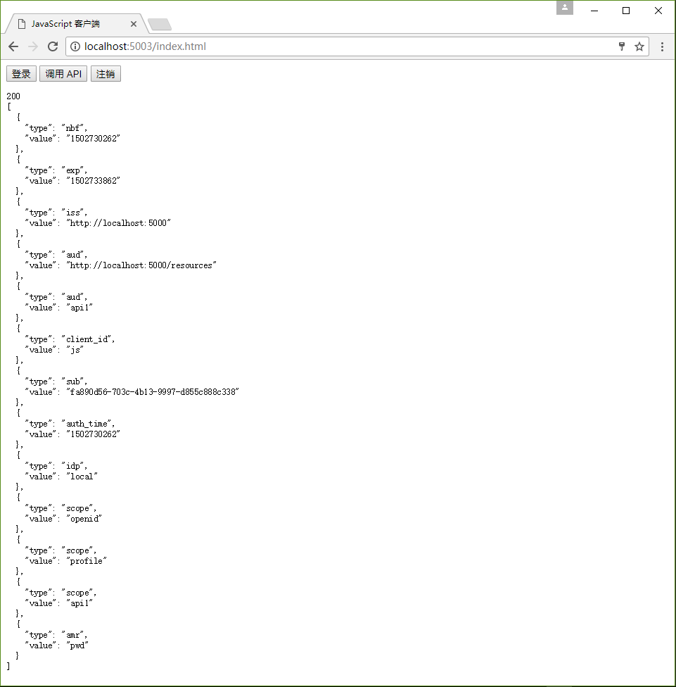

# IdentityServer4 中文文档 -15- （快速入门）添加 JavaScript 客户端

-------------------------------------------------------------------------------------------

原文：http://docs.identityserver.io/en/release/quickstarts/7_javascript_client.html

上一篇：[IdentityServer4 中文文档 -14- （快速入门）使用 ASP.NET Core Identity](http://www.cnblogs.com/ideck/p/ids_quickstarts_14.html)
下一篇：[IdentityServer4 中文文档 -16- （快速入门）使用 EntityFramework Core 存储配置数据](http://www.cnblogs.com/ideck/p/ids_quickstarts_16.html)

该快速入门将展示如何搭建一个 JavaScript 客户端应用程序，其中的用户将登陆到 IdentityServer，使用 IdentityServer 发布的访问令牌调用 Web API，然后从 IdentityServer 注销。

## 新的 JavaScript 客户端项目

创建一个新的 JavaScript 应用程序项目。这可以是一个简单的空的 Web 项目，或者空的 ASP.NET Core 应用程序。这里将使用空的 ASP.NET Core 应用程序。

创建一个新的 ASP.NET Core Web 应用程序：


选择 “空” 模板：


点击“确定”按钮以创建项目。

## 修改宿主

修改宿主（像[之前描述的](http://docs.identityserver.io/en/release/quickstarts/0_overview.html#modify-hosting)一样）以让应用程序运行在 5003 端口上。

## 添加静态文件中间件

考虑到该项目主要运行于客户端，我们需要 ASP.NET 提供构成应用程序的静态 HTML 和 JavaScript 文件。静态文件中间件被设计来做这些事。 添加 NuGet 程序包 `Microsoft.AspNetCore.StaticFiles`：



## 注册静态文件中间件

接下来是在 _Startup.cs_ 文件的 `Configure` 方法中注册静态文件中间件：

```CSharp
public void Configure(IApplicationBuilder app, IHostingEnvironment env, ILoggerFactory loggerFactory)
{
    app.UseDefaultFiles();
    app.UseStaticFiles();
}
```

中间件现在将能够从应用程序的 _~/wwwroot_ 目录提供静态文件 —— 这是我们将要放置 Html 和 JavaScript 文件的地方。

## 引用 oidc-client

在 MVC 项目中，我们使用了一个代码库来处理 OpenID Connect 协议。在该项目中我们也需要一个相似的库，只是这个库要在 JavaScript 中工作并且设计运行于浏览器端。[oidc-client 库](https://github.com/IdentityModel/oidc-client-js)就是这样一个库，可以通过 [NPM](https://github.com/IdentityModel/oidc-client-js)，[Bower](https://bower.io/search/?q=oidc-client) 等获取到该库，还可以[直接从 github 下载](https://github.com/IdentityModel/oidc-client-js/tree/master/dist)该库。

### NPM

如果你想通过 NPM 来下载 _oidc-client_ ,可以按照这些步骤来做：

向你的项目中添加一个新的 NPM 程序包定义文件并命名为 _package.json_：


在 _package.json_ 文件的 `devDependency` 结点中添加一个 `oidc-client` 引用：

```JSON
"devDependencies": {
  "oidc-client": "1.3.0"
}
```

一旦你保存该文件，Visual Studio 应该会自动还原这些程序包到一个名为 _node_modules_ 的目录下：


在 _~/node_modules/oidc-client/dist_ 目录下找到名为 _oidc-client.js_ 的文件，并将其复制到应用程序的 _~/wwwroot_ 目录。有其他更为复杂的方式可以将你的 NPM 程序包复制到 `~/wwwroot` 目录下，但是这些技术超出了当前快速入门的范围。

## 添加你的 Html 和 JavaScript 文件

接下来是将你的 HTML 和 JavaScript 文件添加到 `~/wwwroot` 目录下。这里涉及到两份 HTML 文件和一份面向具体应用程序的 JavaScript 文件（不同于 _oidc-client.js_ 库的文件）。在 _~/wwwroot_ 目录下，添加一份名为 _index.html_ 和一份名为 _callback.html_ 的 HTML 文件，还有一份名为 _app.js_ 的 JavaScript 文件。

### index.html

这将是你应用程序的主页面，它将简单地包含用于用户登录、注销和调用 Web API 的按钮，还将包含引用上述两份 JavaScript 文件的 `<script>` 标签和用于向用户显示消息的 `<pre>` 标签。

它看起来应该是这样的：

```Html
<!DOCTYPE html>
<html>
<head>
    <meta charset="utf-8" />
    <title></title>
</head>
<body>
    <button id="login">Login</button>
    <button id="api">Call API</button>
    <button id="logout">Logout</button>

    <pre id="results"></pre>

    <script src="oidc-client.js"></script>
    <script src="app.js"></script>
</body>
</html>
```
### app.js

该文件将包含我们应用程序的主要代码。首先我们要在里面添加一个帮助器函数来将消息记录到 `<pre>` 标签：

```JavaScript
function log() {
    var results = document.getElementById('results');
    results.innerText = '';
    Array.prototype.forEach.call(arguments, function (msg) {
        if (msg instanceof Error) {
            msg = "错误：" + msg.message;
        } else if (typeof msg !== 'string') {
            msg = JSON.stringify(msg, null, 2);
        }
        results.innerHTML += msg + '\r\n';
    });
}
```

然后添加代码，为上述三个按钮注册 “click” 事件处理程序：

```JavaScript
document.getElementById('login').addEventListener('click', login, false);
document.getElementById('api').addEventListener('click', api, false);
document.getElementById('logout').addEventListener('click', logout, false);
```

接着我们可以使用 _oidc-client_ 库中的 `UserManager` 类型来管理 OpenID Connect 协议。它要求与 MVC 客户端中需要的相似的配置（虽然其中的值不尽相同）。添加这些代码以配置和初始化 `UserManager`：

```JavaScript
var config = {
    authority: 'http://localhost:5000',
    client_id: 'js',
    redirect_uri: 'http://localhost:5003/callback.html',
    response_type: 'id_token token',
    scope: 'openid profile api1',
    post_logout_redirect_uri: 'http://localhost:5003/index.html'
};
var manager = new Oidc.UserManager(config);
```

`UserManager` 提供了一个 `getUser` API 来确定用户是否已经登录到 JavaScript 应用程序。其用了一个 JavaScript `Promise` 来返回异步结果。返回的 `User` 对象具有一个包含用户身份信息的 `profile` 属性。添加以下代码以检测用户是否已经登录到 JavaScript 应用程序：

```JavaScript
manager.getUser().then(function (user) {
    if (user) {
        log('用户已登录', user.profile);
    } else {
        log('用户未登录');
    }
});
```

接下来我们要实现 `login`、`api`、`logout` 等方法。`UserManager` 提供了 `signinRedirect` 来登录用户，还提供了 `signoutRedirect` 来注销用户。在上述代码中我们获取到的 `User` 对象还有一个 `access_token` 属性，这可以用来认证到 web API。`access_token` 将通过 _Bearer_ 模式的 _Authorization_ header 被传递到 web API。添加以下代码以实现我们应用程序中的这三个功能：

```JavaScript
function login() {
    manager.signinRedirect();
}

function api() {
    manager.getUser().then(function (user) {
        var url = "http://localhost:5001/identity";
        var xhr = new XMLHttpRequest();
        xhr.open("GET", url);
        xhr.onload = function () {
            log(xhr.status, JSON.parse(xhr.responseText));
        }
        xhr.setRequestHeader("Authorization", "Bearer " + user.access_token);
        xhr.send();
    });
}

function logout() {
    manager.signoutRedirect();
}
```

### callback.html

当用户登录到 IdentityServer 后，该 HTML 文件是指定的 `redirect_uri` 页面，它将完成与 IdentityServer 间 OpenID Connect 协议的登录握手。之前我们使用的 `UserManager` 提供了所有实现这些的代码。一旦登录完成，我们就可以将用户重定向回 index.html 主页面。添加以下代码以完成登录过程：

```Html
<!DOCTYPE html>
<html>
<head>
    <meta charset="utf-8" />
    <title>登录回调</title>
</head>
<body>
    <script src="scripts/oidc-client.js"></script>
    <script>
        new Oidc.UserManager().signinRedirectCallback().then(function () {
            window.location = 'index.html';
        }).catch(function (e) {
            console.error(e);
        });
    </script>
</body>
</html>
```

## 添加 JavaScript 客户端定义

现在客户端应用程序已经准备好运行了，我们需要在 IdentityServer 中为这个新的 JavaScript 客户端定义一个配置入口。在 IdentityServer 项目中定位到客户端配置（在 _Config.cs_ 文件中），然后为我们新的 JavaScript 应用程序向列表中添加新的 _Client_ 定义。配置看起来应该是这样的：

```CSharp
new Client
{
    ClientId="js",
    ClientName="JavaScript 客户端",
    AllowedGrantTypes = GrantTypes.Implicit,
    AllowAccessTokensViaBrowser=true,

    RedirectUris = { "http://localhost:5003/callback.html" },
    PostLogoutRedirectUris = { "http://localhost:5003/index.html" },
    AllowedCorsOrigins = { "http://localhost:5003" },

    AllowedScopes =
    {
        IdentityServerConstants.StandardScopes.OpenId,
        IdentityServerConstants.StandardScopes.Profile,
        "api1"
    }
}
```

## 允许 Ajax 以 CORS 的方式调用 Web API

最后需要配置的是 web API 项目中的 CORS。这将允许 Ajax 调用从 _http://localhost:5003_ 跨越到 _http://localhost:5001_ 。

### CORS NuGet 程序包

添加 `Microsoft.AspNetCore.Cors` NuGet 程序包。


### 配置 CORS

接着在 _Startup.cs_ 文件的`ConfigureServices` 方法中将 CORS 服务添加到依赖注入系统：

```CSharp
public void ConfigureServices(IServiceCollection services)
{
    services.AddCors(options =>
    {
        // 这里定义一个 CORS 名为“default”的代理。
        options.AddPolicy("default", policy =>
        {
            policy.WithOrigins("http://localhost:5003")
                .AllowAnyHeader()
                .AllowAnyMethod();
        });
    });

    services.AddMvcCore()
        .AddAuthorization()
        .AddJsonFormatters();
}
``` 

最后，在 `Configure` 方法中将 CORS 中间件添加到管道：

```CSharp
public void Configure(IApplicationBuilder app, IHostingEnvironment env, ILoggerFactory loggerFactory)
{
    loggerFactory.AddConsole(Configuration.GetSection("Logging"));
    loggerFactory.AddDebug();

    app.UseCors("default");

    app.UseIdentityServerAuthentication(new IdentityServerAuthenticationOptions()
    {
        Authority = "http://localhost:5000",
        RequireHttpsMetadata = false,
        ApiName = "api1"
    });

    app.UseMvc();
}
```

## 运行 JavaScript 客户端

现在你应该能够运行 JavaScript 客户端了：



点击 “登录” 按钮以登录用户。当用户被返回到 JavaScript 应用程序时，你应该能够看到他们的身份信息：


然后点击 “调用 API” 以调用 web API：



最后点击 “注销” 以注销用户。

你现在已经入门了使用 IdentityServer 进行登录，注销以及认证 Web API 调用的 JavaScript 客户端应用程序。


上一篇：[IdentityServer4 中文文档 -14- （快速入门）使用 ASP.NET Core Identity](http://www.cnblogs.com/ideck/p/ids_quickstarts_14.html)
下一篇：[IdentityServer4 中文文档 -16- （快速入门）使用 EntityFramework Core 存储配置数据](http://www.cnblogs.com/ideck/p/ids_quickstarts_16.html)
