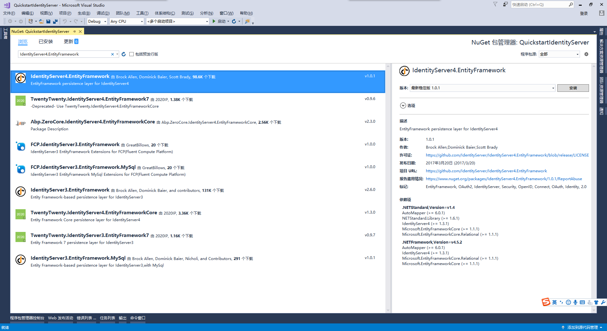
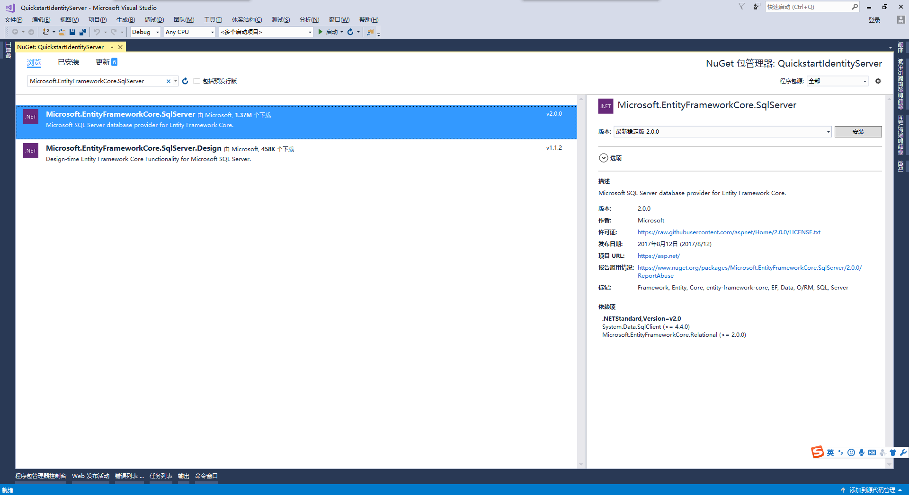
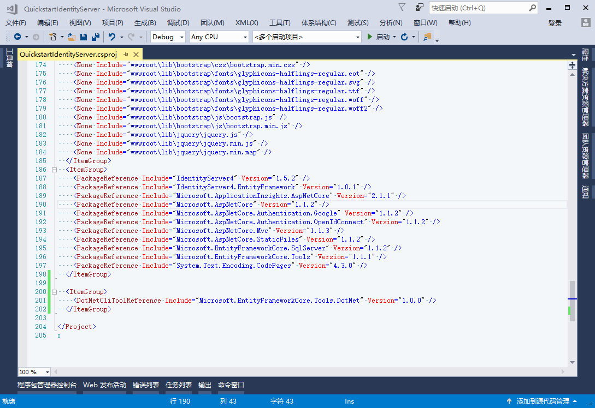
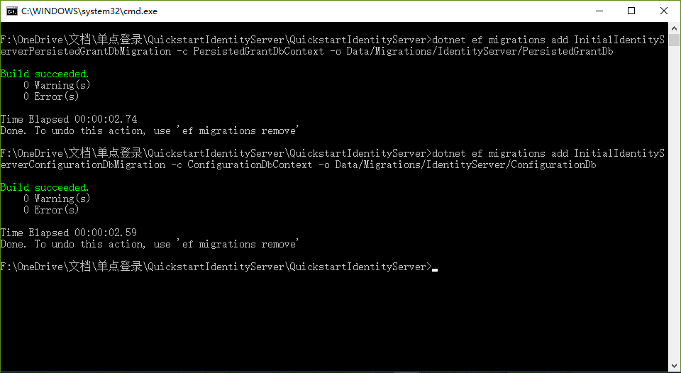

# IdentityServer4 中文文档 -16- （快速入门）使用 EntityFramework Core 存储配置数据

--------------------------------------------------------------------------

原文：http://docs.identityserver.io/en/release/quickstarts/8_entity_framework.html

上一篇：[IdentityServer4 中文文档 -15- （快速入门）添加 JavaScript 客户端](http://www.cnblogs.com/ideck/p/ids_quickstarts_15.html)

IdentityServer 是为可扩展性设计的，其中一个扩展点是其所需数据的存储机制。该快速入门展示了如何配置 IdentityServer 以使用 EntityFramework（EF）作为其数据存储机制（取代目前为止我们一直使用的内存实现）。

## IdentityServer4.EntityFramework

我们将移动到数据库的数据有两种，第一种是配置数据（资源 resources 和客户端 client 定义数据）。第二种是 IdentityServer 运行时产生的操作数据。这些存储库都是基于接口建模的，并且我们在 _`IdentityServer4.EntityFramework`_ NuGet 程序包中为这些接口提供了一套 EF 实现。

我们从添加 _`IdentityServer4.EntityFramework`_ NuGet 程序包的引用到 IdentityServer 项目中开始（请使用“1.0.1”以上版本的程序包）：



## 添加 SqlServer

鉴于 EF 的灵活性，你现在可以使用任何 EF 支持的数据库。在该快速入门中我们将使用 Visual Studio 自带的 SqlServer LocalDb 版。

为了添加 SqlServer，我们需要多一些 NeGet 程序包。

添加 _`Microsoft.EntityFrameworkCore.SqlServer`_ 程序包：



添加 _`Microsoft.EntityFrameworkCore.Tools`_ 程序包：


接下来，我们要添加一些命令行工具（更多细节请点击[这里](https://docs.microsoft.com/en-us/ef/core/miscellaneous/cli/dotnet)） —— 很不幸，你必须要通过手动编辑 _.csproj_ 文件来实现这些。你可以在 IdentityServer 项目上点击鼠标右键并选择“编辑 QuickstartIdentityServer.csproj”以手动修改 _.csproj_ 文件：


然后添加以下片段到 </Project> 元素标签之前：

```xml
<ItemGroup>
  <DotNetCliToolReference Include="Microsoft.EntityFrameworkCore.Tools.DotNet" Version="1.0.0" />
</ItemGroup>
```

其最终看起来是这样的：



保存并关闭该文件。为了验证你已经安装了工具属性，你可以在项目文件目录下打开命令提示符并运行 `dotnet ef` 命令。运行结果看起来大概是这样的：


## 配置存储

下一个步骤是替换当前在 _Startup.cs_ 的 `ConfigureServices` 方法中调用的 `AddInMemoryClients`、`AddInMemoryIdentityResources` 和 `AddInMemoryApiResources`。我们将用以下代码替换它们：

```CSharp
public void ConfigureServices(IServiceCollection services)
{
    services.AddMvc();

    var connectionString = @"server=(localdb)\mssqllocaldb;database=IdentityServer4.Quickstart.EntityFramework;trusted_connection=yes";
    var migrationsAssembly = typeof(Startup).GetTypeInfo().Assembly.GetName().Name;

    // 配置使用内存存储用户信息，但使用 EF 存储客户端和资源信息。
    services.AddIdentityServer()
        .AddTemporarySigningCredential()
        .AddTestUsers(Config.GetUsers())
        .AddConfigurationStore(builder =>
            builder.UseSqlServer(connectionString, options =>
                 options.MigrationsAssembly(migrationsAssembly)))
        .AddOperationalStore(builder =>
            builder.UseSqlServer(connectionString, options =>
                 options.MigrationsAssembly(migrationsAssembly)));
}
```

上述代码将连接字符串直接硬编码到了代码里面，你可以根据需要进行更改。还有，调用 `AddConfigurationStore` 和 `AddOperationalStore` 其实是为了将 EF 的存储实现注册到系统中。

传递给这些 API 的 “builder” 回调函数是 EF 的机制，这种机制允许你为上述两个存储实现的 `DbContext` 配置对应的 `DbContextOptionsBuilder` —— 这涉及到你将如何使用数据库提供程序来装配 DbContext 类型的实例。这里通过调用 `UseSqlServer` 来使用 SqlServer。你也可以看得出来，这里就是提供数据库连接字符串的地方。

`UseSqlServer` 方法中的 “options” 回调方法则是用来配置 EF 数据迁移定义所在的程序集的。EF 需要使用数据迁移来为数据库定义相应的架构。

> 注意：定义这些迁移应该是你的宿主应用程序的职责，因为它们是特定于你的数据库及其提供程序。

我们接下来将添加数据迁移。

## 添加数据迁移

为了创建迁移，你需要打开命令提示符并定位到 IdentityServer 项目所在的目录，然后运行以下两个命令：

```cmd
dotnet ef migrations add InitialIdentityServerPersistedGrantDbMigration -c PersistedGrantDbContext -o Data/Migrations/IdentityServer/PersistedGrantDb
dotnet ef migrations add InitialIdentityServerConfigurationDbMigration -c ConfigurationDbContext -o Data/Migrations/IdentityServer/ConfigurationDb
```

运行结果看起来应该是这样的：



## 初始化数据库

现在我们有了数据迁移，我们可以编写代码来从数据迁移创建数据库了。我们还将使用之前的快速入门中定义的内存配置数据作为种子来初始化数据库。

在 Startup.cs 中添加以下方法来协助初始化数据库：

```CSharp
private void InitializeDatabase(IApplicationBuilder app)
{
    using (var serviceScope = app.ApplicationServices.GetService<IServiceScopeFactory>().CreateScope())
    {
        serviceScope.ServiceProvider.GetRequiredService<PersistedGrantDbContext>().Database.Migrate();

        var context = serviceScope.ServiceProvider.GetRequiredService<ConfigurationDbContext>();
        context.Database.Migrate();
        if (!context.Clients.Any())
        {
            foreach (var client in Config.GetClients())
            {
                context.Clients.Add(client.ToEntity());
            }
            context.SaveChanges();
        }

        if (!context.IdentityResources.Any())
        {
            foreach (var resource in Config.GetIdentityResources())
            {
                context.IdentityResources.Add(resource.ToEntity());
            }
            context.SaveChanges();
        }

        if (!context.ApiResources.Any())
        {
            foreach (var resource in Config.GetApiResources())
            {
                context.ApiResources.Add(resource.ToEntity());
            }
            context.SaveChanges();
        }
    }
}
```

然后在 `Configure` 方法中调用它：

```CSharp
public void Configure(IApplicationBuilder app, IHostingEnvironment env, ILoggerFactory loggerFactory)
{
    // 人为初始化数据库
    InitializeDatabase(app);

    // 其它原有的代码
    // ...
}
```

现在，如果你运行 IdentityServer 项目，应该会创建数据库并使用之前定义的配置数据初始化它。你应该能够使用 SqlServer Management Studio 或 Visual Studio  连接和检查数据：


## 运行客户端应用程序

现在你应该能够运行所有现有的客户端应用程序并登陆、获取令牌以及调用API了 —— 这些都是基于数据库配置的。

上一篇：[IdentityServer4 中文文档 -15- （快速入门）添加 JavaScript 客户端](http://www.cnblogs.com/ideck/p/ids_quickstarts_15.html)
